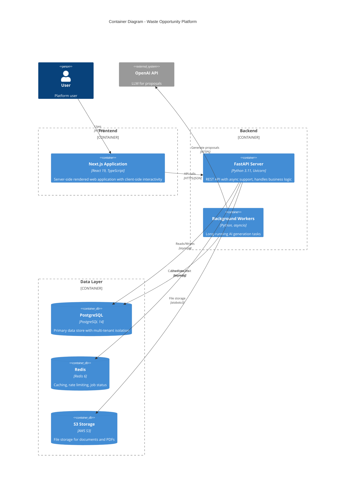
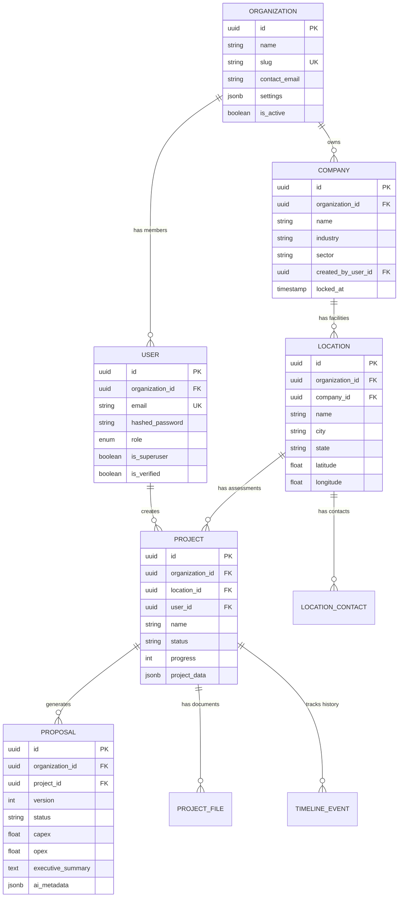
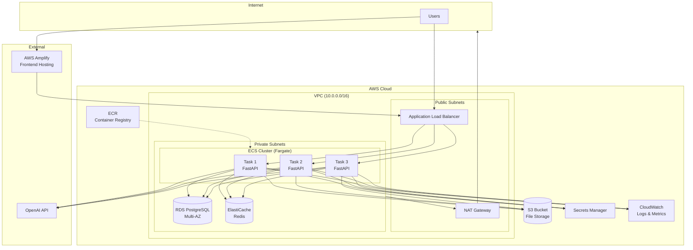
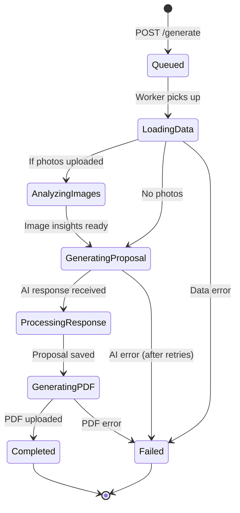
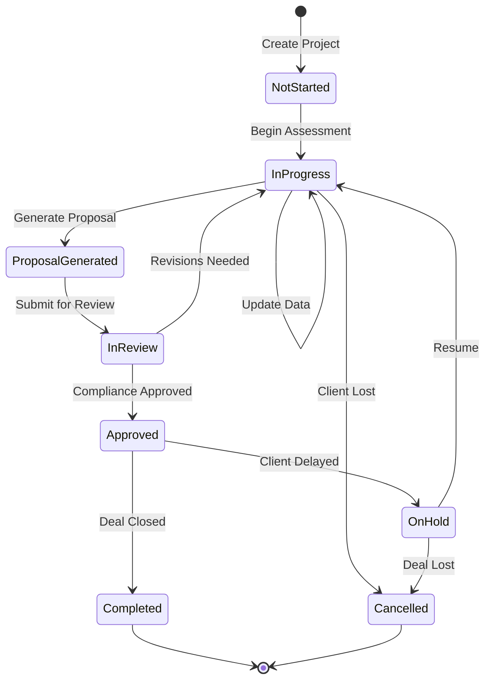

# Waste Opportunity Platform - Comprehensive Documentation

> **AI-powered waste management opportunity identification and proposal generation platform**
>
> `opportunities → AI proposals → compliance gates → CRM/Marketplace sync`

---

## Table of Contents

1. [Executive Summary](#1-executive-summary)
2. [Architecture](#2-architecture)
3. [Implementation](#3-implementation)
4. [Product](#4-product)

---

# 1. Executive Summary

## Platform Overview

The **Waste Opportunity Platform** is a multi-tenant SaaS application that enables waste management companies to identify, assess, and generate AI-powered proposals for waste upcycling and recycling opportunities at client facilities.

### Core Value Proposition

| Stage                | Description                                                          |
| -------------------- | -------------------------------------------------------------------- |
| **Opportunities**    | Identify waste streams at client facilities through site assessments |
| **AI Proposals**     | Generate technical feasibility reports with GO/NO-GO recommendations |
| **Compliance Gates** | Validate against regulatory requirements                             |
| **CRM/Marketplace**  | Sync with sales systems and waste trading platforms                  |

### Technology Stack

````
┌─────────────────────────────────────────────────────────────────┐
│                        FRONTEND                                  │
│  Next.js 15.5 • React 19 • TypeScript • Tailwind CSS v4         │
│  Zustand • React Hook Form • Radix UI • Framer Motion           │
└─────────────────────────────────────────────────────────────────┘
                              │
                              ▼
┌─────────────────────────────────────────────────────────────────┐
│                        BACKEND                                   │
│  FastAPI • Python 3.11+ • SQLAlchemy 2.0 • Pydantic AI          │
│  PostgreSQL • Redis • Alembic • JWT Authentication              │
└─────────────────────────────────────────────────────────────────┘
                              │
                              ▼
┌─────────────────────────────────────────────────────────────────┐
│                     INFRASTRUCTURE                               │
│  AWS • ECS Fargate • RDS PostgreSQL • ElastiCache Redis         │
│  S3 • ALB • Secrets Manager • CloudWatch • Terraform            │
└─────────────────────────────────────────────────────────────────┘

# 2. Architecture (Software Architect Perspective)

## 2.1 Container Diagram



## 2.2 Data Model

The platform implements **organization-level tenant isolation** using composite foreign keys and query filtering at every database access layer.



Every table includes `organization_id` with composite foreign key constraints ensuring cross-tenant isolation at the database level.

## 2.3 AWS Infrastructure



## 2.4 Security

| Layer              | Implementation                                                    |
| ------------------ | ----------------------------------------------------------------- |
| **Network**        | VPC isolation, private subnets, security groups (least privilege) |
| **Transport**      | HTTPS/TLS everywhere, CORS configuration                          |
| **Authentication** | JWT tokens with 24h expiry, bcrypt password hashing               |
| **Authorization**  | Role-based access control (RBAC) with ownership validation        |
| **Data**           | Tenant isolation via composite FKs, RDS encryption at rest        |
| **Secrets**        | AWS Secrets Manager, no credentials in code                       |
| **Rate Limiting**  | Redis-backed, per-endpoint limits (5-60/min)                      |
| **Logging**        | Structured JSON logs, no PII in logs                              |

---

# 3. Implementation

## 3.1 Project Structure

```
waste-platform/
├── backend/
│   ├── app/
│   │   ├── main.py              # FastAPI entry point
│   │   ├── api/v1/              # REST endpoints
│   │   ├── core/                # Config, database, auth
│   │   ├── models/              # SQLAlchemy models
│   │   ├── schemas/             # Pydantic schemas
│   │   ├── services/            # Business logic
│   │   ├── agents/              # AI agents (proposal, image)
│   │   └── authz/policies.py    # RBAC policies
│   ├── alembic/                 # Migrations
│   └── tests/
│
├── frontend/
│   ├── app/                     # Next.js App Router pages
│   ├── components/
│   │   ├── ui/                  # shadcn/Radix primitives
│   │   └── features/            # Domain components
│   └── lib/
│       ├── api/                 # API client
│       ├── stores/              # Zustand stores
│       └── contexts/            # Auth context
│
└── infrastructure/terraform/    # AWS IaC
```

## 3.2 API Endpoints

| Method | Endpoint                  | Description               | Rate Limit |
| ------ | ------------------------- | ------------------------- | ---------- |
| POST   | `/auth/jwt/login`         | Login with email/password | 5/min      |
| POST   | `/auth/register`          | Register new user         | 3/min      |
| GET    | `/auth/me`                | Get current user          | 60/min     |
| GET    | `/companies`              | List companies            | 60/min     |
| POST   | `/companies`              | Create company            | 30/min     |
| GET    | `/companies/{id}`         | Get company detail        | 60/min     |
| GET    | `/projects`               | List projects (filtered)  | 60/min     |
| POST   | `/projects`               | Create project            | 30/min     |
| GET    | `/projects/{id}`          | Get project detail        | 60/min     |
| POST   | `/ai/proposals/generate`  | Start AI generation       | 3/min      |
| GET    | `/ai/proposals/jobs/{id}` | Poll job status           | 60/min     |
| GET    | `/ai/proposals/{id}`      | Get proposal              | 60/min     |
| GET    | `/ai/proposals/{id}/pdf`  | Download PDF              | 30/min     |

## 3.3 AI Pipeline States



---

# 4. Product

## 4.1 RBAC Matrix

| Permission           | Super Admin | Org Admin | Field Agent | Contractor | Compliance | Sales |
| -------------------- | :---------: | :-------: | :---------: | :--------: | :--------: | :---: |
| Manage Organizations |     ✅      |    ❌     |     ❌      |     ❌     |     ❌     |  ❌   |
| Manage Org Users     |     ✅      |    ✅     |     ❌      |     ❌     |     ❌     |  ❌   |
| Create Companies     |     ✅      |    ✅     |     ✅      |     ✅     |     ❌     |  ❌   |
| Edit All Companies   |     ✅      |    ✅     |     ❌      |     ❌     |     ❌     |  ❌   |
| Edit Own Companies   |     ✅      |    ✅     |     ✅      |     ✅     |     ❌     |  ❌   |
| Delete Companies     |     ✅      |    ✅     |     ❌      |     ❌     |     ❌     |  ❌   |
| Create Projects      |     ✅      |    ✅     |     ✅      |     ✅     |     ❌     |  ✅   |
| Generate Proposals   |     ✅      |    ✅     |     ✅      |     ✅     |     ✅     |  ✅   |
| Delete Projects      |     ✅      |    ✅     |     ❌      |     ❌     |     ❌     |  ❌   |

## 4.2 Project Status Workflow



````
