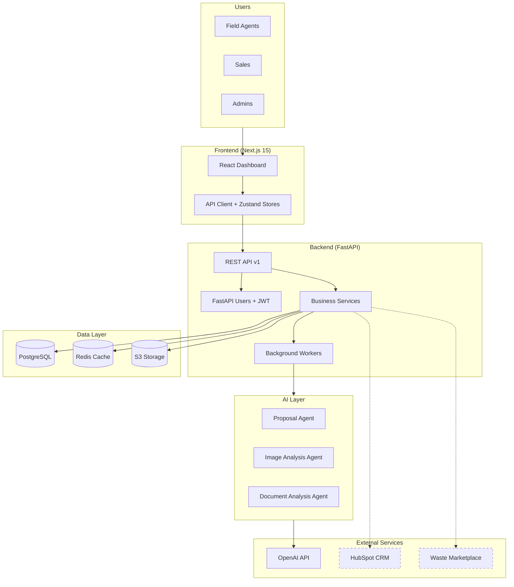
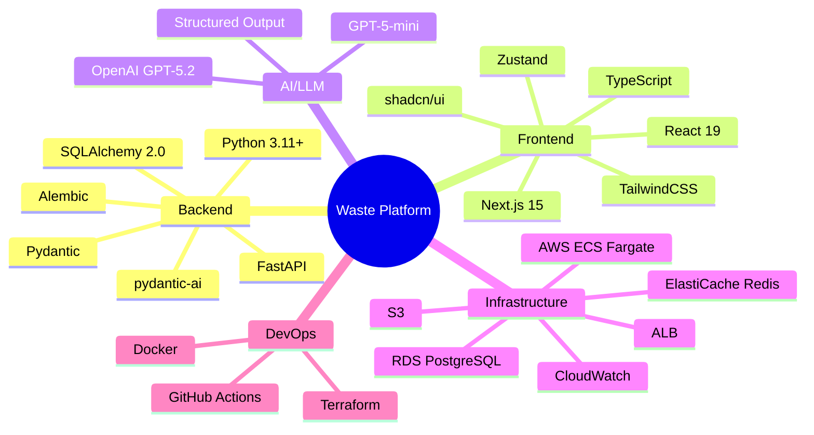
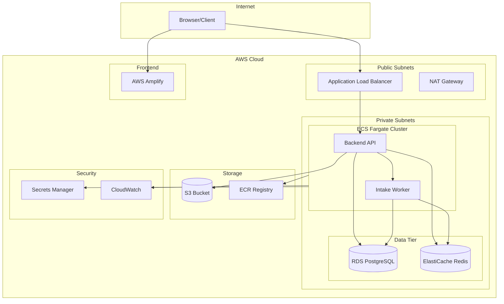
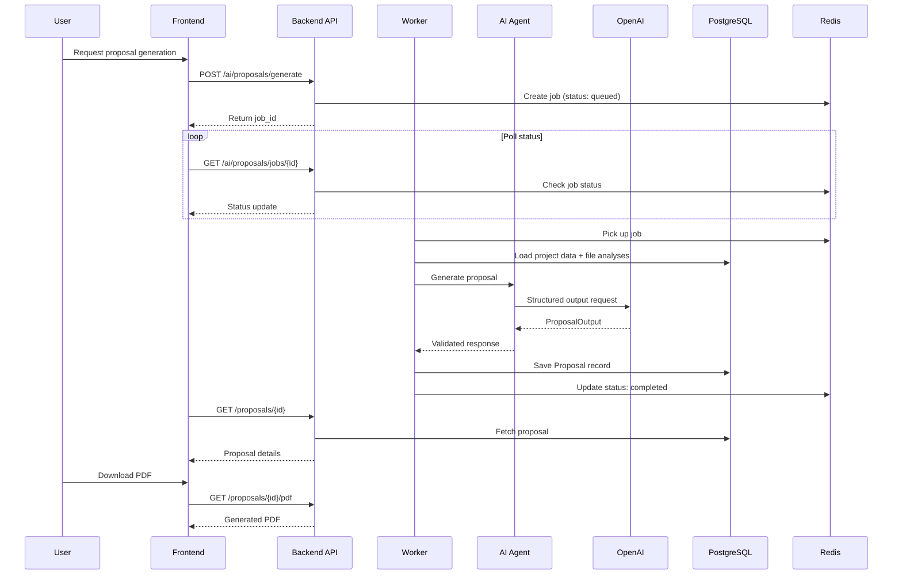
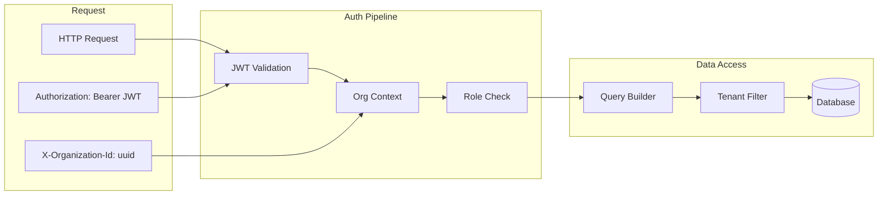
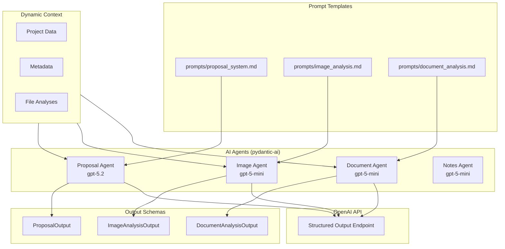
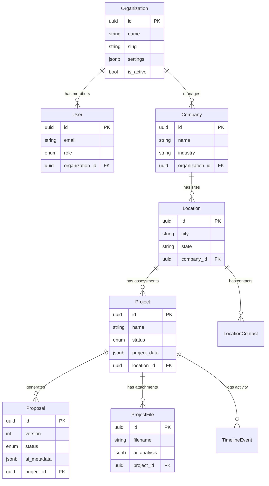
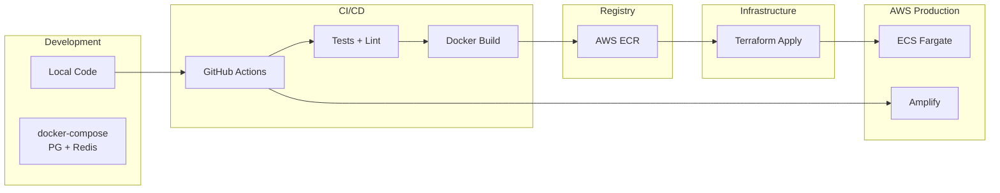

# Waste Opportunity Platform - System Overview

## 1. Product Overview

**AI-powered SaaS platform for waste management companies.**

| Aspect | Description |
|--------|-------------|
| **Problem** | Waste companies lack efficient tools to assess waste streams, generate feasibility reports, and sync with CRM/trading platforms |
| **Solution** | Automated AI proposal generation with compliance gates and integration readiness |
| **Core Flow** | `Opportunities → AI Proposals → Compliance Gates → CRM/Marketplace Sync` |

### Key Components

| Component | Purpose |
|-----------|---------|
| **Backend API** | FastAPI service handling auth, projects, AI orchestration |
| **Frontend App** | Next.js dashboard for opportunity management |
| **AI Agents** | pydantic-ai powered agents for proposal/image/document analysis |
| **Infrastructure** | AWS ECS Fargate, RDS PostgreSQL, ElastiCache Redis |

---

## 2. System Architecture

### Service Responsibilities

| Service | Role |
|---------|------|
| **REST API** | Auth, RBAC, rate limiting, CRUD for all entities |
| **AI Services** | Proposal generation, image/document analysis orchestration |
| **Background Workers** | Async job processing for AI tasks |
| **Cache Layer** | Session storage, rate limiting, job status tracking |

---

## 3. Technology Stack

---

## 4. AWS Infrastructure

### Resource Summary

| Resource | Configuration | Purpose |
|----------|---------------|---------|
| **ECS Fargate** | 2 services (API + Worker) | Serverless containers |
| **RDS PostgreSQL** | Multi-AZ ready | Primary database |
| **ElastiCache Redis** | Single node | Cache + job queue |
| **S3** | Private bucket | File storage (PDFs, images) |
| **ALB** | Public-facing | Load balancing + TLS |
| **Amplify** | Static hosting | Frontend deployment |

---

## 5. Data Flow

### AI Proposal Generation

### Authentication & Multi-Tenancy

---

## 6. AI Agent Architecture

### AI Output Summary

| Agent | Input | Output | Use Case |
|-------|-------|--------|----------|
| **Proposal** | Project data, file analyses | GO/NO-GO recommendation, financials, pathways | Feasibility reports |
| **Image** | Waste photos | Material classification, condition assessment | Intake assessment |
| **Document** | SDSs, reports | Extracted facts, compliance data | Document parsing |
| **Notes** | Free-text notes | Structured intake data | Data extraction |

---

## 7. Entity Model

---

## 8. Deployment Pipeline

### Environment Separation

| Environment | Backend | Frontend | Database |
|-------------|---------|----------|----------|
| **Development** | Local + docker-compose | `bun dev` | Local PostgreSQL |
| **Production** | ECS Fargate | AWS Amplify | RDS PostgreSQL |

---

## 9. Key Architectural Decisions

| Decision | Rationale |
|----------|-----------|
| **JSONB for project_data** | Flexible schema for dynamic questionnaire data |
| **Multi-tenant by design** | Composite FKs with organization_id on all tables |
| **Async AI generation** | Background jobs with polling to avoid timeouts |
| **External prompt files** | Maintainable AI prompts in markdown format |
| **Dual reports** | Internal (full) and External (client-safe) views |
| **Redis rate limiting** | Per-endpoint controls (strict for AI, generous for reads) |
