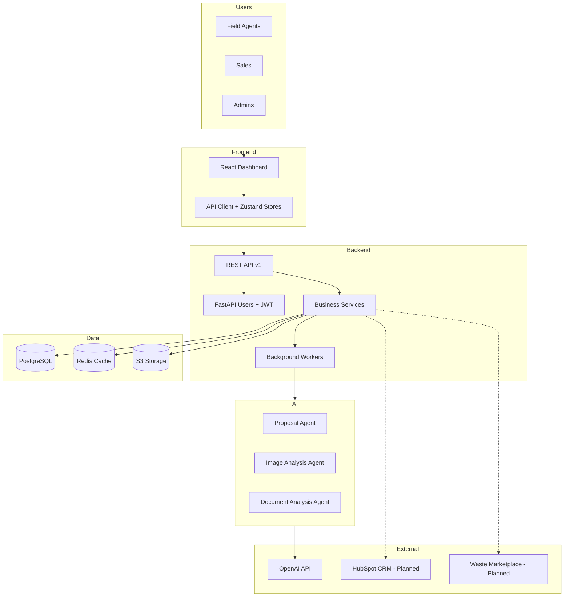
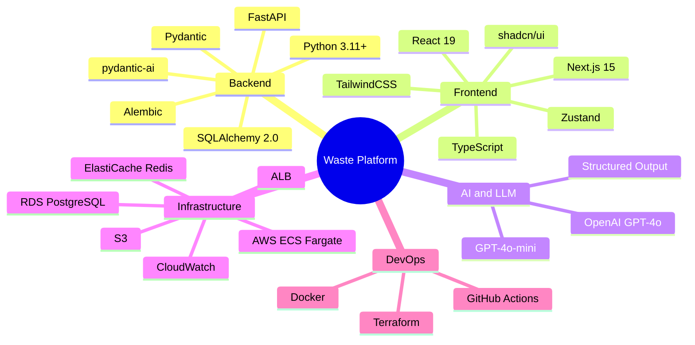
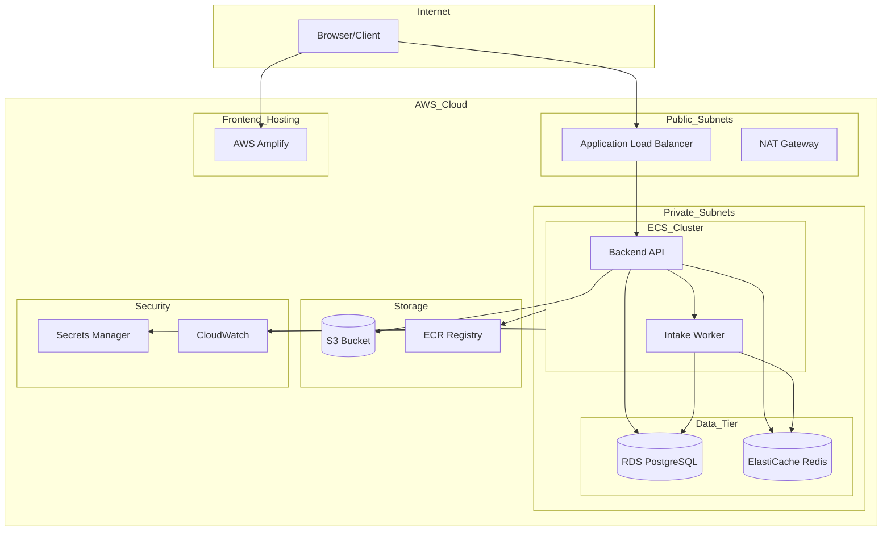
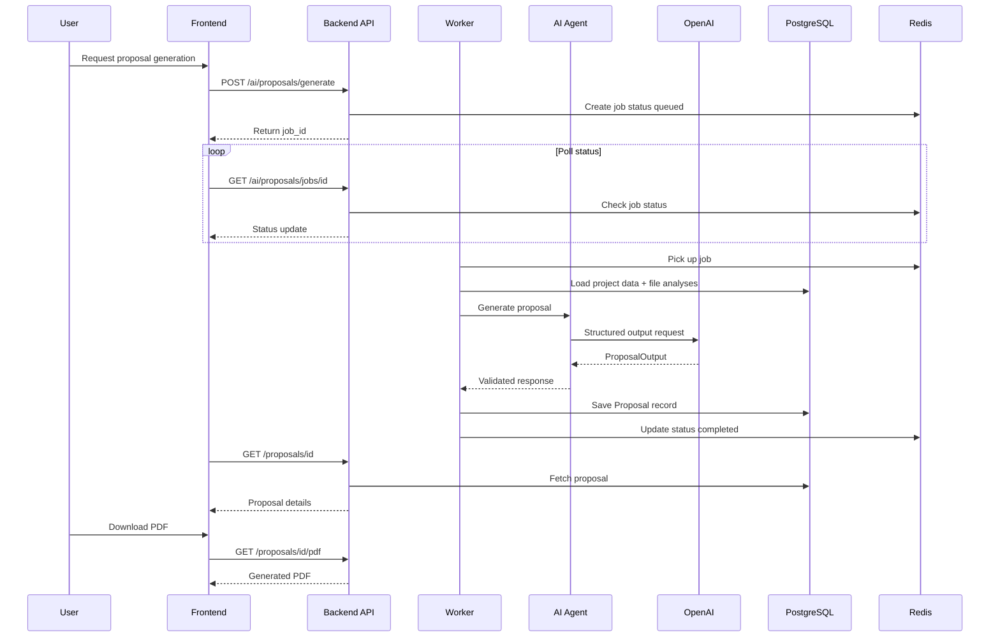
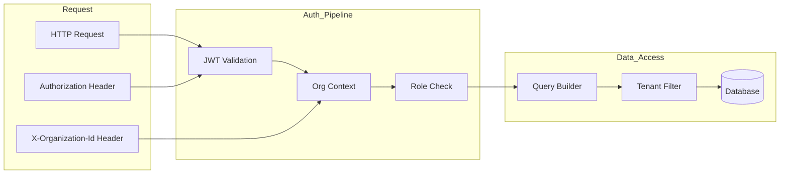
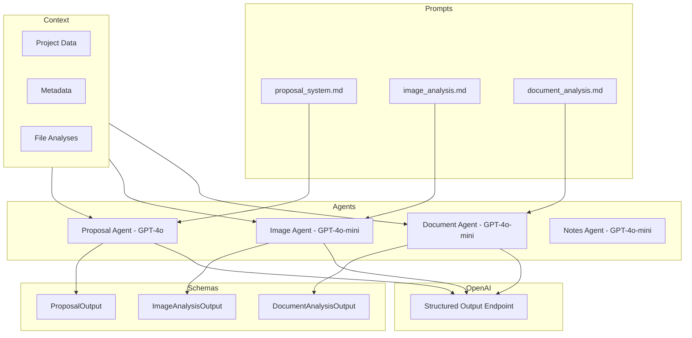
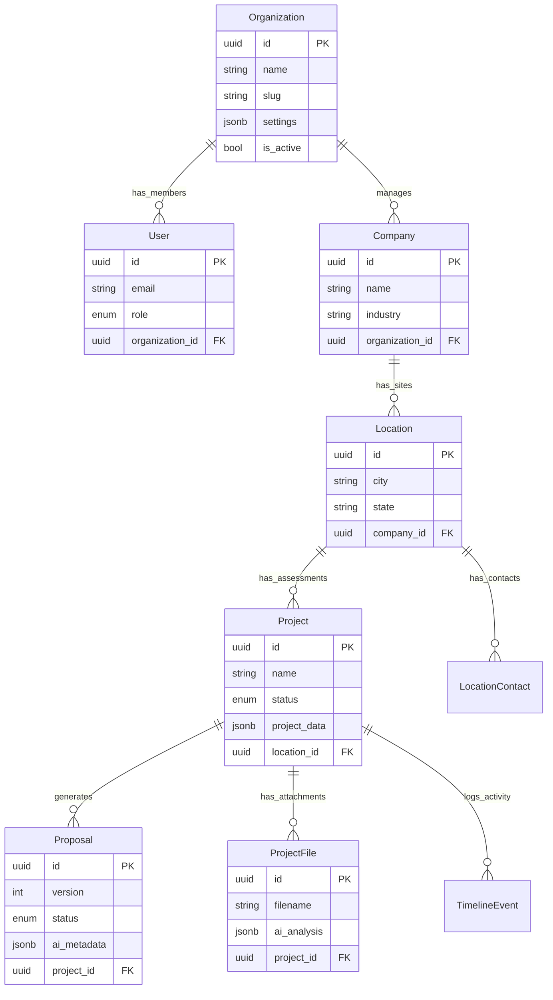
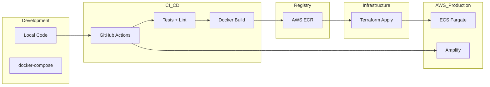

# Waste Opportunity Platform - System Overview

> **Documento para exportación a Google Docs**
> 
> Cada diagrama está en un bloque de código Mermaid. Para convertir a imágenes:
> 1. Copia el contenido del bloque de código (sin las líneas ``` )
> 2. Pégalo en [mermaid.live](https://mermaid.live)
> 3. Exporta como PNG o SVG
> 4. Inserta la imagen en Google Docs en el lugar indicado

---

## 1. Product Overview

**AI-powered SaaS platform for waste management companies.**

| Aspect | Description |
|--------|-------------|
| **Problem** | Waste companies lack efficient tools to assess waste streams, generate feasibility reports, and sync with CRM/trading platforms |
| **Solution** | Automated AI proposal generation with compliance gates and integration readiness |
| **Core Flow** | Opportunities → AI Proposals → Compliance Gates → CRM/Marketplace Sync |

### Key Components

| Component | Purpose |
|-----------|---------|
| **Backend API** | FastAPI service handling auth, projects, AI orchestration |
| **Frontend App** | Next.js dashboard for opportunity management |
| **AI Agents** | pydantic-ai powered agents for proposal/image/document analysis |
| **Infrastructure** | AWS ECS Fargate, RDS PostgreSQL, ElastiCache Redis |

---

## 2. System Architecture

<!-- DIAGRAM 1: System Architecture - Flowchart -->
<!-- Copiar a mermaid.live y exportar como PNG -->



### Service Responsibilities

| Service | Role |
|---------|------|
| **REST API** | Auth, RBAC, rate limiting, CRUD for all entities |
| **AI Services** | Proposal generation, image/document analysis orchestration |
| **Background Workers** | Async job processing for AI tasks |
| **Cache Layer** | Session storage, rate limiting, job status tracking |

---

## 3. Technology Stack

<!-- DIAGRAM 2: Technology Stack - Mindmap -->
<!-- Copiar a mermaid.live y exportar como PNG -->



---

## 4. AWS Infrastructure

<!-- DIAGRAM 3: AWS Infrastructure - Flowchart -->
<!-- Copiar a mermaid.live y exportar como PNG -->



### Resource Summary

| Resource | Configuration | Purpose |
|----------|---------------|---------|
| **ECS Fargate** | 2 services (API + Worker) | Serverless containers |
| **RDS PostgreSQL** | Multi-AZ ready | Primary database |
| **ElastiCache Redis** | Single node | Cache + job queue |
| **S3** | Private bucket | File storage (PDFs, images) |
| **ALB** | Public-facing | Load balancing + TLS |
| **Amplify** | Static hosting | Frontend deployment |

---

## 5. Data Flow

### AI Proposal Generation

<!-- DIAGRAM 4: AI Proposal Generation - Sequence Diagram -->
<!-- Copiar a mermaid.live y exportar como PNG -->



### Authentication & Multi-Tenancy

<!-- DIAGRAM 5: Auth & Multi-Tenancy - Flowchart -->
<!-- Copiar a mermaid.live y exportar como PNG -->



---

## 6. AI Agent Architecture

<!-- DIAGRAM 6: AI Agent Architecture - Flowchart -->
<!-- Copiar a mermaid.live y exportar como PNG -->



### AI Output Summary

| Agent | Input | Output | Use Case |
|-------|-------|--------|----------|
| **Proposal** | Project data, file analyses | GO/NO-GO recommendation, financials, pathways | Feasibility reports |
| **Image** | Waste photos | Material classification, condition assessment | Intake assessment |
| **Document** | SDSs, reports | Extracted facts, compliance data | Document parsing |
| **Notes** | Free-text notes | Structured intake data | Data extraction |

---

## 7. Entity Model

<!-- DIAGRAM 7: Entity Relationship Diagram -->
<!-- Copiar a mermaid.live y exportar como PNG -->



---

## 8. Deployment Pipeline

<!-- DIAGRAM 8: Deployment Pipeline - Flowchart -->
<!-- Copiar a mermaid.live y exportar como PNG -->



### Environment Separation

| Environment | Backend | Frontend | Database |
|-------------|---------|----------|----------|
| **Development** | Local + docker-compose | bun dev | Local PostgreSQL |
| **Production** | ECS Fargate | AWS Amplify | RDS PostgreSQL |

---

## 9. Cost Estimate

| Category | Service | Monthly Cost |
|----------|---------|--------------|
| **Compute** | ECS Fargate | ~$60-80 |
| **Database** | RDS PostgreSQL | ~$50-70 |
| **Cache** | ElastiCache Redis | ~$15-25 |
| **Storage** | S3 | ~$5-10 |
| **Network** | ALB + NAT | ~$50-60 |
| **AI** | OpenAI API | ~$50-200 |
| **Total** | | **~$279-429/month** |

---

## 10. Key Architectural Decisions

| Decision | Rationale |
|----------|-----------|
| **JSONB for project_data** | Flexible schema for dynamic questionnaire data |
| **Multi-tenant by design** | Composite FKs with organization_id on all tables |
| **Async AI generation** | Background jobs with polling to avoid timeouts |
| **External prompt files** | Maintainable AI prompts in markdown format |
| **Dual reports** | Internal (full) and External (client-safe) views |
| **Redis rate limiting** | Per-endpoint controls (strict for AI, generous for reads) |

---

## Instrucciones de Exportación

### Paso 1: Generar imágenes de diagramas

Para cada diagrama numerado (8 en total):

1. Abre [mermaid.live](https://mermaid.live)
2. Borra el código de ejemplo
3. Copia el contenido del bloque de código Mermaid (sin las líneas ```)
4. Verifica que renderice correctamente
5. Click en "Actions" → "Export PNG" (o SVG para mejor calidad)
6. Guarda con nombre descriptivo (ej: `diagram-1-architecture.png`)

### Paso 2: Crear documento en Google Docs

1. Crea un nuevo documento en Google Docs
2. Copia el texto de este documento (sin los bloques de código)
3. En cada sección donde hay un diagrama, inserta la imagen correspondiente
4. Ajusta el tamaño de las imágenes según necesites

### Paso 3: Exportar a PDF

1. En Google Docs: Archivo → Descargar → Documento PDF
2. Revisa el PDF generado

### Lista de diagramas

| # | Sección | Tipo | Descripción |
|---|---------|------|-------------|
| 1 | System Architecture | Flowchart | Vista general del sistema |
| 2 | Technology Stack | Mindmap | Stack tecnológico |
| 3 | AWS Infrastructure | Flowchart | Infraestructura AWS |
| 4 | AI Proposal Generation | Sequence | Flujo de generación de propuestas |
| 5 | Auth & Multi-Tenancy | Flowchart | Pipeline de autenticación |
| 6 | AI Agent Architecture | Flowchart | Arquitectura de agentes AI |
| 7 | Entity Model | ER Diagram | Modelo de datos |
| 8 | Deployment Pipeline | Flowchart | Pipeline de despliegue |
